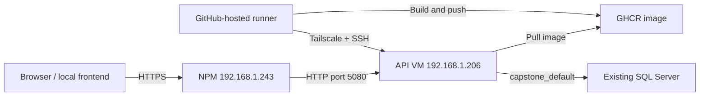

# Backend Dev: Docker + GitHub Actions + Tailscale + NPM

Deployment package prepared on **2026-10-04** from the user's server inspection. This is backend Dev only. No Python AI or frontend container is included. The existing SQL container/database and NPM hosts are reused.

## Targets

| Component | Configuration |
| --- | --- |
| API/SQL VM | Ubuntu 24.04 amd64, 2 vCPU, 5.7 GiB RAM; user `shiori` |
| API VM LAN / Tailscale | `192.168.1.206` / `100.105.191.20`, SSH port `22` |
| API upstream | `http://192.168.1.206:5080`, container port `8080` |
| SQL connection from API | `capstone-sqlserver,1433` on existing external network `capstone_default` |
| Database | Existing `FA26SE103_Dev`; no creation, migration or import at startup |
| NPM server | `192.168.1.243` (`homeserver`), already publishes public HTTP/HTTPS |
| Public Dev API | `https://supermarket-api-dev.kitsuracloud.com` |
| Deploy directory | `/opt/capstone/backend-dev` |



GitHub Actions executes CI/deployment; Docker on the VM hosts the running API after the job finishes. No self-hosted runner or inbound public SSH is needed. The Tailscale action joins the Tailnet for that job using an ephemeral node. See [GitHub-hosted runners](https://docs.github.com/en/actions/concepts/runners/github-hosted-runners) and the [official Tailscale action](https://github.com/tailscale/github-action).

## 1. Prepare the VM once

Run on the API VM as `shiori`:

```bash
sudo install -d -m 700 -o shiori -g shiori /opt/capstone/backend-dev
mkdir -p /opt/capstone/backend-dev/releases
docker network inspect capstone_default >/dev/null
```

Copy the contents of [api.env.example](../deploy/dev/api.env.example) into `/opt/capstone/backend-dev/api.env` with `nano` or SCP, then edit it **on the VM**:

```bash
nano /opt/capstone/backend-dev/api.env
chmod 600 /opt/capstone/backend-dev/api.env
```

Fill `ConnectionStrings__SqlServer` with the existing SQL login, preserving `Server=capstone-sqlserver,1433;Database=FA26SE103_Dev`. Use the Dev application login with access to that database; SQL login and API user accounts are different. The sample enables SQL transport encryption and accepts the current Dev self-signed certificate; use certificate validation when a trusted SQL certificate is configured.

The latest backend scaffold also contains `Incident` and `OperationalEvent`. Before enabling the continuous monitoring worker, confirm the authoritative Dev database already contains its approved runtime increment; this deploy does not run SQL files or EF migrations. With `Monitoring__Enabled=false`, the API-only first rollout does not start that worker, but readiness still proves only that SQL accepts a connection, not that every expected table/column exists.

Fill `Jwt__Key` with a random value of at least 32 UTF-8 bytes (for example, a 48-byte Base64 key generated locally). Fill the three Cloudinary credential values from your private configuration. Keep Provider `Cloudinary` to read the already uploaded cloud assets. If using Local storage intentionally, switch Provider to `Local` and ensure the old floor-plan files are also restored.

The runtime env file is loaded with Compose **`format: raw`** (requires Compose 2.30+; the inspected VM has 5.5.1). Enter literal values **without wrapping quotes**. `$`, `#`, and spaces within a value are not interpolated; connection-string quoting rules still apply inside the SQL value. Keep each setting on one line. Do not print `api.env`, expanded `docker compose config`, or full `docker inspect` output into shared logs. See [Compose env-file raw format](https://docs.docker.com/reference/compose-file/services/#format).

`ASPNETCORE_ENVIRONMENT=Staging` identifies this hosted Dev instance, with a Release build and **Dev DB**. It avoids local Development demo routes. `Swagger__Enabled=true` explicitly exposes Swagger for API testing here; existing JWT/RBAC still protects API operations. Disable Swagger when it is no longer needed. The API-only sample also sets `Monitoring__Enabled=false`: the newly merged continuous monitoring worker requires the separate Python AI service, which this deployment deliberately does not host. Configuration CRUD/review/activation APIs remain available; enable the worker only after the AI service and runtime database increment are deployed and accepted.

The Compose service has a 1 GiB memory limit, bounded logs and restart policy. It creates three named volumes with the image's non-root ownership: keys, recorded videos and local floor plans. It does not create or replace SQL, AI, NPM, the SQL volume, backups or networks. FFmpeg and curl are included in the image; no .NET/FFmpeg install is required on the VM.

## 2. Configure GitHub access

In the backend GitHub repository, create an **Environment named `dev`**. Add these environment secrets:

| Secret | Value |
| --- | --- |
| `TS_OAUTH_CLIENT_ID` | Tailscale OAuth client ID |
| `TS_OAUTH_SECRET` | Its secret, with writable `auth_keys` scope and the `tag:ci` tag |
| `DEV_SSH_PRIVATE_KEY` | Dedicated OpenSSH private deployment key, without a passphrase |
| `DEV_SSH_KNOWN_HOSTS` | Pinned public SSH host-key entry for the API VM |

Optional environment variables already have these defaults in the workflow: `DEV_SSH_HOST=100.105.191.20`, `DEV_SSH_USER=shiori`, `DEV_SSH_PORT=22`.

In Tailscale's access policy, allow the CI tag to connect to the API VM on TCP port 22, while retaining existing team rules. The OAuth client must be permitted to issue `tag:ci` nodes. Use the existing OpenSSH service, not Tailscale SSH, for this workflow. If the VM currently intercepts SSH with Tailscale SSH, adjust that configuration so this key-based OpenSSH connection can reach port 22. See [Tailscale action prerequisites](https://github.com/tailscale/github-action#prerequisites).

Generate a dedicated deployment key on your trusted computer with `ssh-keygen -t ed25519`, saving it under a new filename such as `capstone-dev-actions`; leave its passphrase empty for this workflow. Add **only the `.pub` content** as a new line in `/home/shiori/.ssh/authorized_keys` on the VM, preserving existing keys. Set `.ssh` permissions to 700 and `authorized_keys` to 600. Store the private file contents directly in `DEV_SSH_PRIVATE_KEY`; never commit or paste it into chat.

On the VM, these commands print **public host-key information only**:

```bash
printf '100.105.191.20 '
cat /etc/ssh/ssh_host_ed25519_key.pub
ssh-keygen -lf /etc/ssh/ssh_host_ed25519_key.pub
```

Use the first output line (`100.105.191.20 ssh-ed25519 ...`) for `DEV_SSH_KNOWN_HOSTS`. For a nondefault SSH port use `[100.105.191.20]:PORT` instead. Verify this key through your existing trusted VM session; the workflow requires strict host-key checking.

GHCR image push/pull uses the job's automatic `GITHUB_TOKEN`, with `packages: write` in the build job and `packages: read` in deployment. No permanent registry PAT is needed. If an existing package has separate permissions, grant the backend repository Actions access to it. The SSH user already runs Docker without sudo; keep that capability for deployment. Repo members permitted to deploy consequently have control of the API VM's Docker workload: restrict the Dev environment/branch access to the team.

DB/JWT/Cloudinary secrets stay in the VM's private env file; the runner only carries SSH/Tailscale credentials and a short-lived registry token.

## 3. First workflow run

Commit/review this package on the feature branch, then merge it into `dev` through the normal PR process. A push/merge to **`dev` automatically deploys the Dev API**. `workflow_dispatch` is also defined for reruns, but GitHub only shows manual dispatch after the workflow exists on the repository's default branch; the jobs still run only when the selected ref is `dev`. Feature, `main` and pull-request refs do not deploy.

For the first rollout, either merge to `dev` or run **Actions → Deploy backend Dev → Run workflow** and select `dev`. It runs non-SQL tests, validates the shell script, builds a Linux amd64 image and pushes the commit tag to GHCR. The deployment uses the immutable **image digest**, joins Tailscale, verifies SSH's host key, copies only Compose/deploy script to a numbered release, then starts the API.

`api.env` must already exist on the VM. The workflow never uploads, prints or overwrites it. A temporary Docker config handles private GHCR authentication and is removed at exit.

The existing `MF-01 backend` CI remains unchanged, including its separately configured optional isolated SQL integration job. The deploy workflow's test selection does not run SQL integration against the team database. Passing `/health/ready` proves connectivity to the selected DB, **not schema/seed correctness**; verify MF-01 endpoints after deployment.

Check from the VM after a successful run:

```bash
docker ps --filter name=capstone-backend-dev
docker stats --no-stream capstone-backend-dev
curl -fsS -H 'Host: supermarket-api-dev.kitsuracloud.com' http://192.168.1.206:5080/health/live
curl -fsS -H 'Host: supermarket-api-dev.kitsuracloud.com' http://192.168.1.206:5080/health/ready
```

Readiness waits up to 120 seconds and failure restores the previous successful image **and its Compose file**. On a failed first rollout the new API is stopped. Only the API service is updated; volumes are preserved. Both CI concurrency and a remote `flock` serialize deployments. Failed builds/pulls leave the running API untouched. Deployments can cause a brief API interruption; no zero-downtime guarantee.

## 4. DNS and NPM

Create DNS host **`supermarket-api-dev`** pointing to the **existing public NPM ingress**: an A record for its public IP or a CNAME for its working public DDNS hostname. Do not point public DNS at a LAN or Tailscale IP. Existing router forwarding for NPM port 80/443 is reused; the API VM needs no separate public port forward.

In existing NPM on `homeserver`, add a new Proxy Host:

| Field | Value |
| --- | --- |
| Domain Names | `supermarket-api-dev.kitsuracloud.com` |
| Scheme | `http` |
| Forward Hostname / IP | `192.168.1.206` |
| Forward Port | `5080` |
| SSL | Request Let's Encrypt for this domain, Force SSL |

Keep existing Proxy Hosts unchanged. For this host's Advanced configuration, set:

```nginx
client_max_body_size 210m;
proxy_read_timeout 300s;
proxy_send_timeout 300s;
```

This covers floor plans (20 MB) and recorded MP4 (200 MB), with endpoint-specific limits still enforced. Verify no overlapping custom `client_max_body_size` or forwarded-header overrides. NPM should send the public Host and standard `X-Forwarded-For` / `X-Forwarded-Proto` headers. See [NPM advanced configuration](https://nginxproxymanager.com/advanced-config/).

The backend trusts **one proxy hop**, only from `192.168.1.243`, before rate limiting/auth. It reads forwarded scheme/IP, never arbitrary forwarded Host. This keeps HTTPS floor-map URLs and per-client login limits correct. If NPM's actual source arrives via Tailscale instead, verify the peer address and configure `100.89.16.15` as the trusted proxy; do not clear the trust list or trust every address. Docker bridge NAT is expected to preserve the VM's LAN source in this setup, but the actual proxy path still needs acceptance testing. See [ASP.NET proxy configuration](https://learn.microsoft.com/en-us/aspnet/core/host-and-deploy/proxy-load-balancer?view=aspnetcore-10.0).

Test connectivity **from the NPM container**, not just its host (curl or wget according to what is installed):

```bash
docker exec nginx-proxy-manager curl -fsS -H 'Host: supermarket-api-dev.kitsuracloud.com' http://192.168.1.206:5080/health/ready
```

Allow LAN NPM → API 5080 in the VM/router firewall if necessary. Do not change unrelated port-forward or dual-WAN routing rules. Then check public HTTPS from a client outside the home LAN:

```bash
curl -fsS https://supermarket-api-dev.kitsuracloud.com/health/ready
```

Swagger: `https://supermarket-api-dev.kitsuracloud.com/swagger`. Login, Authorize with the token, then read default store/floors/setup overview to confirm DB mappings/seed and roles. Do not use a production API user/password on this Dev endpoint.

## 5. Existing Cloudinary, keys and recorded camera

Cloudinary assets already uploaded remain remote and readable with matching credentials. Existing DB map references may still contain `localhost:5080`; the backend resolves the storage/version reference rather than fetching that literal host. Saved URLs are not rewritten at startup; new upload responses use the current request host/scheme. The frontend's authenticated map download calls the current API's floor-map endpoint. After proxy deployment, verify a floor map can be downloaded with JWT and new upload responses use the HTTPS domain. The map endpoint remains authenticated; an anonymous browser URL should be rejected.

Current recorded camera has `username=NULL` and `credential_secret_ref=NULL`; there is no camera password to decrypt. The backend can generate its own new Data Protection keys on the server as needed. Persist `/app/.local/keys` in `capstone_backend_dev_keys` and back it up when encrypted camera credentials are introduced. JWT signing keys and hashed account passwords serve separate purposes.

The Data Protection key ring is **not copied into the Docker image and is not a GitHub secret**. Compose mounts the named volume `capstone_backend_dev_keys` at `/app/.local/keys`; ASP.NET creates keys there on demand, and later deployments reattach the same volume. With the currently inspected NULL camera credential reference, start with a fresh server key ring. If the Dev database later contains a non-NULL encrypted camera credential, the exact key ring that encrypted it must be restored, otherwise edit that camera connection and enter its password again.

If another camera has credentials encrypted by a local backend, restore the corresponding **Dev key ring** before reading them, or re-enter that camera password on the new backend. Do not mix production/local rings. Default filesystem key storage on Linux is not encrypted at rest; protect access to Docker volumes and backups. Recreating the container retains the named volumes; never use `docker compose down -v` for upgrades.

The inspected RECORDED/FILE `stream_uri` points to `file:///C:/...` and cannot exist on Ubuntu. Keep `CameraHealth__Enabled=false` for the first rollout to avoid repeatedly probing that path. Then:

1. Open Cameras using the deployed API and upload the same MP4 again (stored in the persistent server volume).
2. If the camera source is locked by an ACTIVE monitoring configuration, deactivate that configuration first. Upload updates the source and invalidates the old test/enable result.
3. Run **Test connection → Preview → Enable**, then reactivate the configuration if its review passes.
4. Set `CameraHealth__Enabled=true` in the VM's `api.env` and recreate the API via the workflow. This resumes the MF-01 health worker; deployment does not auto-test/enable/activate cameras.

Ordinary FFmpeg frame preview and camera testing work without Python AI. AI preview requests need the separate AI service and may return `AI_SERVICE_UNAVAILABLE` (503); continuous AI incident evaluation is not provided by this deployment.

The local frontend can call this API. Change its `VITE_API_URL` to `https://supermarket-api-dev.kitsuracloud.com` (without `/api`; the client already prefixes endpoint paths) and restart Vite. Current CORS permits `http://localhost:5173` and `http://127.0.0.1:5173`; add the exact origin if using another port. Log in again to receive a token signed by the server's JWT key.

## Recovery and routine updates

Rerun the workflow for a reviewed ref to deploy a new digest. A healthy rollback requires the previous release directory/image and working current SQL/runtime configuration. Runtime secrets and database changes are **not** rolled back by this script. The last successful release/digest is saved in `/opt/capstone/backend-dev/.active-release` (no secrets); previous image references should not be pruned until no longer needed for recovery.

For a manual rollback, select an earlier successful image digest in a retained release and invoke its `deploy.sh` with the GHCR username, supplying a read-capable registry token via **stdin**. Avoid putting the token in the command line or shell history. The same readiness and state tracking apply. If the only issue is env configuration, fix `api.env` first and rerun.

After changing `api.env` without a new image, use the active release on the VM:

```bash
cd /opt/capstone/backend-dev
exec 9>.deploy.lock
flock -w 300 9
mapfile -t active < .active-release
export API_ENV_FILE=/opt/capstone/backend-dev/api.env API_IMAGE="${active[1]}"
docker compose -f "${active[0]}/compose.yml" up -d --no-deps --force-recreate --pull never --wait --wait-timeout 120 api
flock -u 9
```

These commands expect a previous successful rollout. Check `docker logs --tail 100 capstone-backend-dev` privately if startup/readiness fails; share only sanitized errors. `/health/live` checks process availability; `/health/ready` checks SQL connectivity. Neither proves NPM/DNS reachability, Cloudinary credentials, camera readiness or AI availability. Those require the acceptance steps above.

This package has not accessed/deployed to either server. Actual GitHub/GHCR permissions, Tailscale ACL, SSH authorization, VM volume permissions, DNS, NPM HTTPS and live DB/Cloudinary/video acceptance remain to be exercised by the first rollout.
